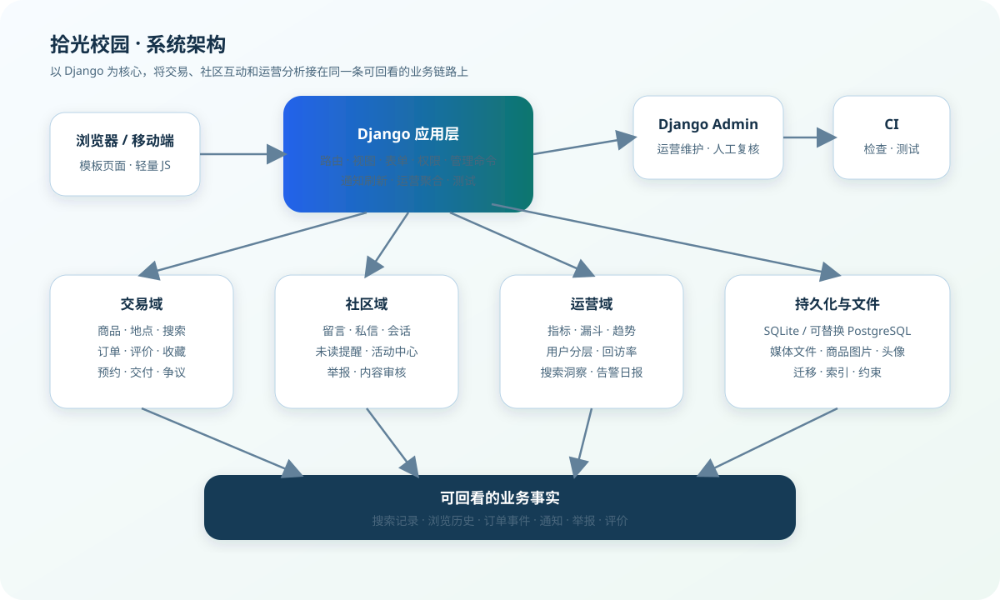
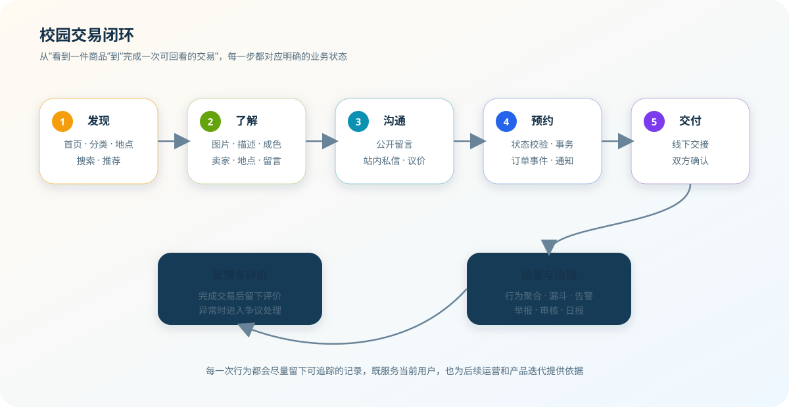

   # 拾光校园 · Campus Glimmer

> 让闲置在校园里继续流转，也让每一次相遇都更有回应。

[](https://www.djangoproject.com/)
[](https://www.python.org/)
[](https://github.com/strawberry-little-bear/campus_glimmer/actions/workflows/django.yml)
[](LICENSE)

拾光校园（Campus Glimmer）是一个面向校园生活的二手交易与社区协作项目。它从“发布一件闲置、找到一个买家”的小闭环出发，逐步补齐校园交易中经常被忽略的细节：在哪里交付、如何沟通、预约是否有效、交易进行到哪一步、消息是否被看到、问题由谁处理，以及运营者如何了解站内真实需求。

项目不是一次性推倒重做的演示页面，而是按真实业务链路持续演进的 Django 项目。每次迭代尽量同时考虑数据模型、页面交互、权限边界、数据库迁移、后台运营和自动化测试，让新增能力能够自然地接入原有系统。

## 目录

- [项目定位](#项目定位)
- [系统概览](#系统概览)
- [功能模块](#功能模块)
- [典型业务流程](#典型业务流程)
- [运营数据闭环](#运营数据闭环)
- [项目结构](#项目结构)
- [核心数据模型](#核心数据模型)
- [权限与安全边界](#权限与安全边界)
- [本地运行](#本地运行)
- [配置说明](#配置说明)
- [Docker 运行](#docker-运行)
- [后台与定时任务](#后台与定时任务)
- [测试与持续集成](#测试与持续集成)
- [当前取舍与边界](#当前取舍与边界)
- [后续路线图](#后续路线图)
- [参与开发](#参与开发)
- [License](#license)

## 项目定位

校园二手交易和普通电商并不完全相同。校园用户通常在相对有限的地理范围内活动，交易更依赖当面沟通和时间协调；商品生命周期短，供需变化快；用户既是买家，也是卖家、内容参与者和社区成员。因此，项目将“商品列表”作为入口，但不把系统目标局限在商品 CRUD：

- 对用户，重点是降低从发现商品到完成交易的沟通成本；
- 对交易双方，重点是提供可追踪的预约、状态和交付确认；
- 对社区，重点是保留通知、举报、内容审核和争议处理的入口；
- 对运营者，重点是把搜索、浏览、收藏、预约和完成交易等行为整理成可解释的指标；
- 对项目本身，重点是用小步、可回溯的独立提交持续迭代，而不是一次性堆叠大量改动。

## 系统概览

下面的架构图描述当前项目的主要边界。图中“运营看板”和“站内通知”使用同一套业务数据，但通过权限和通知偏好隔离普通用户与管理员能力。



### 技术栈

| 层次 | 当前方案 | 说明 |
| --- | --- | --- |
| Web 框架 | Django 5.1+ | URL 路由、视图、模板、表单、认证和管理后台 |
| 编程语言 | Python 3.11+ | 业务逻辑、数据统计、管理命令和测试 |
| 数据库 | SQLite（默认） | 适合本地开发、演示和轻量部署；生产环境可替换 |
| 页面层 | Django Templates + 静态资源 | 服务端渲染为主，未读提醒和部分筛选交互使用轻量 JavaScript |
| 文件存储 | 本地 media 目录 | 商品图片和头像；容器运行时使用独立数据卷 |
| Web 服务 | Django 开发服务器 / Gunicorn | Docker 镜像默认使用 Gunicorn |
| 自动化 | GitHub Actions | 语法检查、Django 系统检查、迁移检查和测试 |

## 功能模块

### 1. 商品发布与校园地点

- 发布、编辑、删除商品，支持标题、描述、价格、分类、成色和多图上传；
- 商品状态覆盖“在售、已预订、已售出”等主要阶段；
- 商品可以绑定已配置的校园地点，包括校区、楼栋和更具体的交易说明；
- 支持按关键词、分类、地点、成色和价格区间组合筛选；
- 支持按最新发布、价格和相关度排序，并提供分页；
- 商品详情展示卖家资料、地点、留言、收藏状态、相近商品和可用的交易操作；
- 用户可以收藏商品，也可以对暂时不可用的商品开启有货提醒；
- 首页提供分类入口、热门地点、最新商品和基于可解释信号的推荐。

> 当前“就近”是基于校园地点数据的筛选，不依赖 GPS，也不会把用户实时位置上传到服务端。这样更适合校园内的固定交易点，也为后续增加距离、时间段或校区偏好留下扩展空间。

### 2. 搜索、保存与推荐

- 全局搜索支持关键词、分类、校园地点、成色和价格条件；
- 搜索框支持基于历史搜索、分类和地点的联想建议；
- 搜索词、筛选条件和结果数量会以结构化记录保存，用于分析供需缺口；
- 用户可以保存搜索条件，并在后续查看或启用、停用保存的搜索；
- 推荐结果优先使用分类、地点、热度和新鲜度等可解释信号；
- 推荐反馈会被记录，便于后续判断推荐是否真正帮助用户发现商品；
- 搜索运营页可以查看热门搜索、去重用户数、无结果比例和可回到商品列表的跟进入口。

### 3. 交易预约与订单状态

- 买家从商品详情发起交易预约；
- 预约创建时校验商品状态，并使用事务和行级锁尽量避免并发预约同一件商品；
- 买卖双方可以在订单详情中推进交易状态；
- 交易确认后可以提出交付时间、结束时间和校园地点，另一方可接受或暂不接受；
- 系统会检查买卖双方当前有效的交付安排，拦截重叠时间段，减少同一用户同时答应多笔交易的爽约风险；
- 每次交付安排都会留下提议人、回应人、时间和状态，重新协商时保留同一订单的可追溯链路；
- 接受交付安排后订单自动进入“待当面交付”，再由双方分别完成交付确认；
- 记录订单事件，保留状态变化和时间线，方便回看交易过程；
- 支持交付确认、评价和交易争议入口；
- 交易争议可以由买卖双方补充 JPG、PNG、WebP 或 PDF 证据，平台和交易参与人可以在受保护的下载入口中查看；
- 证据上传会写入订单事件时间线，并向另一方发送站内提醒，方便核实争议发生前后的过程。
- 通过管理命令处理临近超时提醒，并自动释放已经过期的预约；
- 订单相关通知会根据状态变化、提醒策略和用户通知偏好生成。

### 4. 私信、留言与通知中心

- 商品详情页支持公开留言；
- 用户之间可以围绕商品发送站内私信；
- 会话列表按最近消息聚合，展示最近一条消息、消息总数和未读数量；
- 支持按用户、商品或消息内容搜索会话，并可批量标记已读；
- 站内通知中心按通知类型、时间和已读状态组织消息；
- 顶部导航会定时刷新私信和站内通知未读数，页面切到后台时暂停刷新，重新回到前台后恢复；
- 活动中心会聚合交易、收藏、保存搜索、评价、审核和运营提醒等动态；
- 用户可以按类别关闭不需要的提醒，管理员还可以单独控制运营告警日报；
- 新商品发布后会与有效求购按分类、地点、预算和关键词进行轻量匹配，并通过可关闭、可去重的站内通知提醒求购发布者；

### 5. 社区治理与后台处理

- 用户可以举报商品，举报包含原因、补充说明和处理状态；
- 管理员可以在举报队列中查看、审核和记录处理备注；
- 私信和留言经过内容审核规则后，保留审核事件、命中规则、风险等级和复核状态；
- 交易争议有独立处理入口，避免把异常订单埋在普通订单列表中；
- 管理后台提供用户、商品、分类、校园地点、订单、通知和审核相关数据的维护入口；
- 治理操作尽量留下结构化记录，便于追责、复盘和后续运营分析。

### 6. 运营看板与运营告警

管理员可以按 7 天、30 天、90 天或 1 年查看运营数据，主要包括：

- 商品发布、浏览、收藏、预约、完成交易、搜索、新用户和举报数量；
- 有效求购数量、匹配通知量、被触达求购数和匹配通知阅读率，用来观察供需撮合是否真正产生回应；
- “详情浏览 → 收藏 → 预约 → 完成交易”的去重转化漏斗；
- 每日趋势、订单状态、分类供给和校园地点供给；
- 当前周期与上一段同长度周期的变化对比；
- 基于发布、搜索、浏览、收藏、交易和私信行为的活跃用户分层；
- 基于新用户 cohort 的回访率，并明确统计样本口径；
- 无结果搜索比例、待处理举报队列和完成交易环比变化形成的运营提醒；
- 脱敏 CSV 导出，方便留档、复盘或交给外部分析工具继续处理。

管理员还可以通过管理命令发送运营告警日报。日报只投递给活跃管理员，尊重个人通知偏好，并使用“日期 + 统计周期”的幂等键避免同一日报重复刷屏。

### 7. 校园身份与可信交易

- 管理员可以在后台配置允许使用的校园邮箱域名，并单独启用或停用某个域名；
- 用户可以从个人资料发起校园邮箱认证，系统发送一次性验证链接；
- 验证链接默认 24 小时有效，重新发送会使之前的令牌失效；
- 认证成功后，商品详情的卖家信息会展示校园认证标识；
- 同一个校园邮箱不能绑定多个账号，认证状态与学校名称会保留在账户档案中；
- 验证令牌只以哈希形式保存，认证完成后清空令牌哈希，不把明文令牌写入数据库。

> 校园认证只证明用户可以控制某个已配置的校园邮箱，不等同于平台对个人身份、商品质量或线下交易结果的担保。

## 典型业务流程

下面的流程图展示一条从发现商品到完成交易的完整链路。每个阶段都对应页面动作、业务约束和可回看的数据记录。



### 用户视角

1. **发现**：用户从首页、分类、地点或搜索结果进入商品列表；
2. **筛选**：根据价格、成色、地点和状态缩小范围；
3. **了解**：查看图片、描述、卖家信息、地点和其他用户留言；
4. **沟通**：通过留言或私信确认商品细节、交付时间和交易地点；
5. **预约**：发起预约，系统校验商品是否仍可交易；
6. **推进**：双方更新订单状态，系统生成订单事件和必要通知；
7. **交付**：在线下完成交接后，由双方确认交付；
8. **反馈**：交易结束后评价，遇到异常时可以发起争议或举报。

### 系统视角

- 商品是交易入口，订单是状态主线；
- 私信和通知负责把状态变化传递给相关用户；
- 订单事件、浏览历史、搜索记录、评价和举报构成可回看的业务事实；
- 运营看板对这些事实做周期聚合，而不是直接修改交易数据；
- 管理员通知偏好和日报幂等键，保证运营提醒可控、可重复执行而不重复投递。

## 运营数据闭环

运营模块遵循“记录行为 → 聚合指标 → 识别问题 → 发送提醒 → 进入处理页面”的链路：

1. **记录行为**：保存搜索词、筛选条件、结果数量、浏览、收藏、预约、订单事件、私信和举报等结构化数据；
2. **聚合指标**：按统计周期计算供给、需求、活跃度、转化漏斗、回访率和治理队列；
3. **识别问题**：识别无结果搜索、待处理举报堆积、完成交易下降等运营告警；
4. **发送提醒**：管理员可以运行 `send_operations_digest`，将告警摘要写入站内通知中心；
5. **进入处理**：通知携带运营看板地址，管理员可以直接回到对应统计周期继续分析。

日报是幂等的：同一个管理员、同一个日期、同一个统计周期只会生成一条对应通知。这样可以将命令接入系统计划任务，而不必担心重复执行造成通知刷屏。

## 项目结构

```text
campus_glimmer/
├── accounts/                  # 注册、登录、个人资料和账户测试
├── chat_messages/             # 商品留言、私信、内容审核和会话测试
├── campus_glimmer/            # Django 项目配置、根路由和健康检查
├── listings/                  # 商品、订单、搜索、通知、运营和治理业务
│   ├── analytics.py           # 运营指标、漏斗、分层、回访和运营提醒
│   ├── availability.py        # 商品可用性与有货提醒
│   ├── forms.py               # 商品、搜索、通知偏好等表单
│   ├── models.py              # 商品、地点、订单、通知等核心模型
│   ├── notifications.py       # 通知生成和通知相关业务
│   ├── operations_digest.py   # 运营告警日报构建与幂等投递
│   ├── order_workflow.py      # 订单状态流转和交付相关逻辑
│   ├── meeting_scheduling.py  # 交付时间安排与冲突检测
│   ├── recommendations.py     # 推荐结果和推荐反馈
│   ├── reputation.py          # 卖家交易信誉摘要与公开指标
│   ├── saved_searches.py      # 保存搜索条件
│   ├── views.py               # 商品、订单、搜索、通知和运营页面
│   ├── migrations/            # 数据库迁移
│   └── management/commands/   # 预约超时处理、运营日报等管理命令
├── templates/                 # Django 模板和页面布局
├── static/                    # CSS、JavaScript、图标等静态资源
├── media/                     # 本地开发时的上传文件目录
├── docker/                    # 容器相关辅助文件
├── docs/                      # 架构图、业务流程图和项目文档
├── Dockerfile
├── docker-compose.yml
├── init_data.py               # 本地演示数据初始化脚本
├── manage.py
├── requirements.txt
└── README.md
```

## 核心数据模型

项目使用 Django ORM 管理业务数据，当前模型可以按以下几组理解：

| 领域 | 主要模型 | 作用 |
| --- | --- | --- |
| 商品 | `Category`、`CampusLocation`、`Item`、`ItemImage` | 商品分类、校园地点、商品主体和图片 |
| 互动 | `Favorite`、`ItemAvailabilityWatch`、`Comment`、`PrivateMessage` | 收藏、有货提醒、公开留言和私信 |
| 交易 | `Order`、`OrderEvent`、`MeetingAppointment`、`DeliveryConfirmation`、`Rating` | 交易预约、交付时间协商、状态事件、双方确认和完成后的评价 |
| 搜索 | `SearchQuery`、`SearchClick`、`SearchImpression`、`SavedSearch`、`SearchSynonym` | 搜索需求、点击、曝光、保存搜索和联想词 |
| 通知 | `Notification`、`NotificationPreference` | 站内提醒、未读状态、通知偏好、求购关联和幂等键 |
| 身份与信任 | `CampusDomain`、`CampusVerification`、`Rating` | 校园邮箱域名配置、身份认证和交易信誉摘要 |
| 治理 | `Report`、`ModerationEvent`、`OrderDispute`、`OrderDisputeEvidence` | 商品举报、内容审核、交易争议、证据和复核记录 |
| 运营 | 订单、浏览、搜索、收藏等行为记录的聚合 | 看板、漏斗、用户分层、回访率和运营告警 |

关键约束包括：

- 收藏、商品有货提醒等重复关系通过数据库约束或幂等逻辑避免重复；
- 订单创建在事务中校验并锁定商品，降低并发预约冲突；
- 通知读取、订单操作、评价、举报和运营数据访问均在服务端校验身份；
- 争议证据下载只允许订单买卖双方或管理员访问，不直接暴露原始 media 链接；
- 搜索和运营数据尽量保存为结构化字段，便于重新计算和解释指标；
- 上传文件保存在 media 目录，数据库不直接保存二进制内容；
- 校园认证令牌只保存 Django 密码哈希，验证成功或重新发送后旧令牌不能继续使用；
- 校园邮箱域名由管理员显式配置，未配置或已停用的域名不能发起认证。

## 权限与安全边界

### 普通用户

- 只能编辑、删除自己发布的商品；
- 只能查看和操作自己参与的订单、私信、通知和收藏；
- 只能修改自己的资料和通知偏好；
- 可以举报商品或内容，但不能直接改变审核结论；
- 可以发起校园邮箱认证，但不能自行把认证状态改为已认证。

### 管理员

- 可以访问运营看板、搜索洞察、举报队列、争议队列和内容审核队列；
- 可以处理举报、争议和审核事件，并留下处理记录；
- 可以接收运营告警日报，但是否接收由个人通知偏好控制；
- 不能绕过服务端权限检查直接代替普通用户完成交易操作。

### 部署注意事项

- 生产环境必须替换 `DJANGO_SECRET_KEY`；
- 不要提交生产数据库、上传文件、密钥或包含用户隐私的日志；
- 启用 HTTPS 后，应同步配置安全重定向、Session Cookie、CSRF Cookie 和可信来源；
- 面向真实用户时，应进一步配置反向代理、限流、备份、日志和媒体文件访问策略。

## 本地运行

### 1. 获取代码并创建虚拟环境

```bash
git clone https://github.com/strawberry-little-bear/campus_glimmer.git
cd campus_glimmer
python -m venv .venv
```

Windows PowerShell：

```powershell
.\.venv\Scripts\Activate.ps1
```

macOS / Linux：

```bash
source .venv/bin/activate
```

### 2. 安装依赖并准备数据库

```bash
python -m pip install -r requirements.txt
python manage.py migrate
```

如果需要创建管理员账号：

```bash
python manage.py createsuperuser
```

如果需要快速准备演示数据，可以执行：

```bash
python init_data.py
```

### 3. 启动开发服务器

```bash
python manage.py runserver
```

常用地址：

| 页面 | 地址 |
| --- | --- |
| 首页 | <http://127.0.0.1:8000/> |
| 商品列表 | <http://127.0.0.1:8000/listings/> |
| 搜索 | <http://127.0.0.1:8000/listings/search/> |
| 我的订单 | <http://127.0.0.1:8000/listings/orders/> |
| 消息中心 | <http://127.0.0.1:8000/messages/inbox/> |
| 站内通知 | <http://127.0.0.1:8000/listings/notifications/> |
| 运营看板（管理员） | <http://127.0.0.1:8000/listings/operations/> |
| 搜索洞察（管理员） | <http://127.0.0.1:8000/listings/operations/search-insights/> |
| 举报队列（管理员） | <http://127.0.0.1:8000/listings/reports/> |
| 交易争议（管理员） | <http://127.0.0.1:8000/listings/disputes/> |
| 管理后台 | <http://127.0.0.1:8000/admin/> |
| 健康检查 | <http://127.0.0.1:8000/healthz/> |

## 配置说明

本地开发可以直接使用默认配置。需要调整时，复制示例文件：

```bash
cp .env.example .env
```

Windows PowerShell：

```powershell
Copy-Item .env.example .env
```

| 变量 | 作用 | 默认值 |
| --- | --- | --- |
| `DJANGO_SECRET_KEY` | Django 密钥，生产环境必须替换 | 本地开发占位值 |
| `DJANGO_DEBUG` | 是否开启调试模式 | `1` |
| `DJANGO_ALLOWED_HOSTS` | 允许访问的域名，逗号分隔 | `127.0.0.1,localhost,testserver` |
| `DJANGO_CSRF_TRUSTED_ORIGINS` | HTTPS 或反向代理场景下的可信来源 | 空 |
| `DJANGO_DB_PATH` | SQLite 数据库文件路径 | `db.sqlite3` |
| `DJANGO_SECURE_SSL_REDIRECT` | 是否强制跳转 HTTPS | `0` |
| `DJANGO_SESSION_COOKIE_SECURE` | 是否只通过 HTTPS 发送会话 Cookie | `0` |
| `DJANGO_CSRF_COOKIE_SECURE` | 是否只通过 HTTPS 发送 CSRF Cookie | `0` |
| `DJANGO_EMAIL_BACKEND` | Django 邮件后端；本地可使用控制台后端，生产环境建议配置 SMTP | DEBUG 时为 console，生产环境为 SMTP |
| `DJANGO_DEFAULT_FROM_EMAIL` | 校园认证邮件的发件地址 | `no-reply@campus-glimmer.local` |

项目默认使用 SQLite，是为了让新贡献者可以低成本启动和验证完整流程。正式部署时，可以将数据库迁移到 PostgreSQL，并根据规模加入缓存、对象存储、日志和备份服务。

## Docker 运行

项目提供了适合本地演示和轻量部署的容器配置：

```bash
docker compose up --build
```

启动后访问 <http://127.0.0.1:8000/>。Docker 配置默认使用 SQLite，数据库和上传文件分别通过 `campus_data`、`campus_media` 数据卷持久化。停止容器后再次启动时，数据不会因为容器重建而自动消失。

如果要停止服务：

```bash
docker compose down
```

如果要连同数据卷一起清理，请确认其中没有需要保留的数据后再执行：

```bash
docker compose down -v
```

## 后台与定时任务

项目将需要周期执行的工作封装成 Django management command，便于接入 Windows 任务计划程序、cron、容器任务或其他调度系统。

### 预约超时处理

发送临近截止的提醒，并释放已经过期的预约：

```bash
python manage.py process_order_timeouts
python manage.py process_order_timeouts --reminder-hours 6
```

### 运营告警日报

按统计周期构建运营告警，并向符合条件的活跃管理员发送站内通知：

```bash
python manage.py send_operations_digest
python manage.py send_operations_digest --days 30
```

可选周期为 `7`、`30`、`90` 或 `365` 天。命令没有发现告警时不会生成空通知；同一天、同一周期重复运行时也不会向同一管理员重复投递。

## 测试与持续集成

本地提交前建议执行：

```bash
python -m compileall -q accounts campus_glimmer chat_messages listings
python manage.py check
python manage.py makemigrations --check --dry-run
python manage.py test
git diff --check
```

GitHub Actions 在推送到 `main` 或提交 Pull Request 时执行以下检查：

1. 拉取代码并配置 Python 3.12；
2. 安装 `requirements.txt` 中的依赖；
3. 对主要 Django 应用执行 Python 语法检查；
4. 执行 Django system check；
5. 检查是否存在未生成的数据库迁移；
6. 运行完整测试集。

CI 的目标不是替代本地验证，而是确保每个独立迭代至少满足“能导入、能启动、迁移一致、测试通过”这组基本条件。

## 当前取舍与边界

- **先保证交易一致性，再扩展体验**：订单创建使用事务和锁，避免同一商品被并发预约；
- **先采用服务端渲染**：核心页面保持 Django 模板结构，降低部署和维护成本；
- **消息刷新保持轻量**：使用未读摘要接口和定时刷新，不引入 WebSocket 基础设施；
- **推荐保持可解释**：优先使用分类、地点、热度和新鲜度信号，不把黑盒模型作为交易判断依据；
- **运营指标可重新计算**：行为记录和统计口径尽量清晰，避免只保存不可追溯的最终数字；
- **SQLite 只作为默认方案**：适合开发和轻量部署，不把当前容器配置当作大规模生产架构；
- **当前就近不是实时定位**：地点筛选不会推断用户位置，也不提供 GPS 距离承诺；
- **内容审核仍是可扩展基础**：已有审核事件和人工复核入口，敏感词策略、分级处置和更细的审计还可以继续完善。

## 后续路线图

项目会围绕“更贴近校园场景、更完整的交易闭环、更可靠的社区治理”继续迭代，方向包括：

- **搜索与供给**：完善无结果搜索的补给建议、搜索趋势、筛选偏好和校园需求预测；
- **交易交付**：在现有确认码、预约异常和争议证据链基础上，继续完善爽约处置与交付后的售后协商；
- **校园场景**：探索毕业季批量发布、免费赠送、短期借用和商品自动过期；
- **循环价值**：增加校园闲置循环指数，展示物品再次流转和资源节约的可解释数据；
- **信任体系**：继续完善校园认证、响应速度、交易安全卡和可解释的异常交易识别；
- **社区治理**：加入敏感词分级、举报优先级、审核工作台、申诉和处理结果反馈；
- **通知体验**：细化通知分组、批量操作、免打扰时间和更及时的消息同步；
- **供需匹配**：继续完善求购匹配评分、匹配解释、价格建议和匹配后的沟通转化统计；
- **基础设施**：支持 PostgreSQL、缓存、对象存储、结构化日志、备份和更完整的生产部署；
- **体验完善**：优化移动端布局、无障碍、图片处理、校园配置和运营工具；
- **数据质量**：继续明确指标口径，增加异常行为识别和运营动作后的效果评估。

这些方向会继续拆成可以独立验证、独立回滚的功能提交，不以一次性重做为目标。

## 参与开发

欢迎提出具体的校园交易场景，也欢迎提交代码、测试、设计和文档改进。适合的贡献方向包括：

- 改进搜索、筛选、推荐和校园地点体验；
- 增加交易安全、交付确认和社区治理能力；
- 优化移动端页面、通知中心和无障碍细节；
- 补充模型、视图、权限和关键流程测试；
- 完善部署、监控、数据维护和运营分析；
- 根据真实校园使用经验调整分类、地点和交易流程。

建议按照以下方式提交改动：

1. 先说明要解决的使用场景和影响的业务链路；
2. 将一个独立功能的模型、页面、权限、测试和文档尽量放在同一组改动中；
3. 提交前运行本地检查和测试；
4. 使用清晰的中文提交信息，保持每个提交可独立理解和回溯；
5. 不提交本地数据库、上传文件、密钥或临时调试产物。

## License

本项目采用 [MIT License](LICENSE)。
## 项目架构与业务闭环
### 系统架构

### 交易闭环

